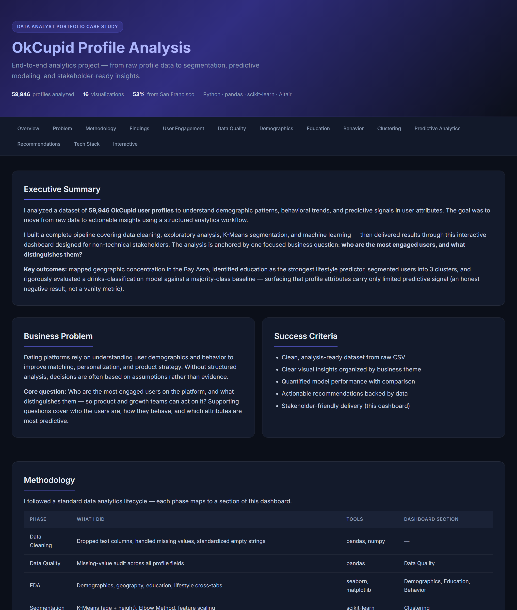

# OkCupid Profile Analysis — Data Analyst Case Study

An end-to-end analytics project on ~60,000 OkCupid user profiles: from raw CSV to
data-quality auditing, exploratory analysis, K-Means segmentation, predictive
modeling, and a stakeholder-ready **interactive HTML dashboard** — all generated
automatically by a single Python script.

> Built as a portfolio piece to demonstrate the full data-analytics lifecycle:
> cleaning → EDA → segmentation → modeling → communication.

**🔗 Live dashboard:** https://tomerhakak.github.io/okcupid-analysis/ &nbsp;·&nbsp; **📓 Narrated notebook:** [`okcupid_analysis.ipynb`](okcupid_analysis.ipynb)

[](https://tomerhakak.github.io/okcupid-analysis/)

<p align="center"><em>👆 Click the preview to open the live interactive dashboard.</em></p>

---

## ❓ The business question

> **Who are the most engaged users on the platform, and what distinguishes them?**

**Answer:** users with the most complete profiles are **~13 percentage points more
likely to be active** (online in the last 30 days) than those with the least complete
profiles. Encouraging profile completion is therefore a direct, low-cost lever for
engagement — the single most actionable finding in this analysis.

---

## 📊 Dashboard preview

Running the pipeline produces a self-contained `dashboard.html` (also written as
`index.html` for GitHub Pages) with an executive summary, methodology, KPIs,
17 visualizations, and business recommendations.

View it live at the link above, or open [`dashboard.html`](dashboard.html) locally.

---

## 🔑 Key findings

| Finding | Detail |
|---|---|
| **Completeness drives engagement** | The most complete profiles are ~13 pts more likely to be active than the least complete — the key actionable lever (~75% of users active in last 30 days). |
| **Hyper-local audience** | Over half of all profiles are from San Francisco — the dataset is geographically concentrated in the Bay Area. |
| **Young & single** | Median age ~30; the large majority report "single" status. |
| **Data quality gaps** | `offspring` (~59% missing), `diet` (~41%), and `religion` (~34%) are sparsely filled; `income` is undisclosed (`-1`) by ~81% of users. |
| **Segmentation** | K-Means on age × height (with the Elbow Method) reveals 3 distinct user segments. |
| **Honest modeling** | See below — a deliberate lesson in *why accuracy alone misleads*. |

### A note on the predictive model (the important part)

Predicting the 6-class `drinks` attribute is a **class-imbalanced** problem:
~73% of users answer "socially". A naive model that *always* guesses "socially"
therefore scores **73% accuracy** — while learning nothing.

This project treats that as a teaching moment rather than a vanity metric:

| Model | Accuracy | Macro-F1 | Balanced Acc. |
|---|---|---|---|
| Baseline (majority class) | **0.73** | 0.14 | 0.17 |
| Random Forest (`class_weight="balanced"`) | 0.43 | **0.20** | **0.22** |

Accuracy actually **drops** once the model stops collapsing onto the majority
class — but macro-F1 and per-class recall **improve**, because the model now
genuinely distinguishes between categories. The honest conclusion: **profile
attributes carry only weak signal for predicting drinking habits.** Reporting
only "73% accuracy" would have hidden this entirely.

---

## 🗂️ Project structure

```
okcupid-analysis/
├── work.py                  # The full pipeline (cleaning → EDA → ML → dashboard)
├── okcupid_analysis.ipynb   # Narrated notebook with rendered outputs
├── dashboard.html           # Auto-generated portfolio dashboard
├── index.html               # Same dashboard, served by GitHub Pages
├── plots/                   # Generated charts (PNG) + interactive Altair chart (HTML)
├── requirements.txt
└── README.md
```

The dataset (`okcupid_profiles.csv`, ~131 MB) is **not committed** — it exceeds
GitHub's 100 MB file limit. See below to obtain it.

---

## ▶️ How to run

1. **Get the dataset.** Download `okcupid_profiles.csv` from Kaggle
   ([OkCupid Profiles dataset](https://www.kaggle.com/datasets/andrewmvd/okcupid-profiles))
   and place it in the project root, next to `work.py`.

2. **Install dependencies** (Python 3.12 recommended):
   ```bash
   pip install -r requirements.txt
   ```

3. **Run the pipeline:**
   ```bash
   python work.py
   ```
   This regenerates everything in `plots/`, rebuilds `dashboard.html` / `index.html`,
   and opens the dashboard in your browser.

4. **Or explore the notebook** for the narrated walkthrough:
   ```bash
   jupyter notebook okcupid_analysis.ipynb
   ```

---

## 🛠️ Tech stack

`Python 3.12` · `pandas` · `numpy` · `scikit-learn` · `seaborn` · `matplotlib` · `Altair` · `HTML/CSS`

---

## 📈 What this project demonstrates

- **Data cleaning** — dropping free-text essay columns, normalizing empty strings to `NaN`, filtering invalid ranges.
- **Data-quality assessment** — systematic missing-value audit with thresholds.
- **EDA & storytelling** — demographics, geography, education, and lifestyle cross-tabs with consistent, presentation-ready styling.
- **Unsupervised learning** — K-Means segmentation with the Elbow Method and feature scaling.
- **Supervised learning done honestly** — baseline comparison, class balancing, and the right metrics for imbalanced data.
- **Communication** — an auto-generated, stakeholder-friendly dashboard, not just a notebook.

---

## 👤 About

Built by **Tomer Hakak** as a data-analyst portfolio project.

- 📧 Email: [tomerhakak15@gmail.com](mailto:tomerhakak15@gmail.com)
- 💻 GitHub: [@tomerhakak](https://github.com/tomerhakak)

> Dataset: [OkCupid Profiles (Kaggle)](https://www.kaggle.com/datasets/andrewmvd/okcupid-profiles).
> Used here for educational, non-commercial portfolio purposes. Released under the MIT License — see [`LICENSE`](LICENSE).
